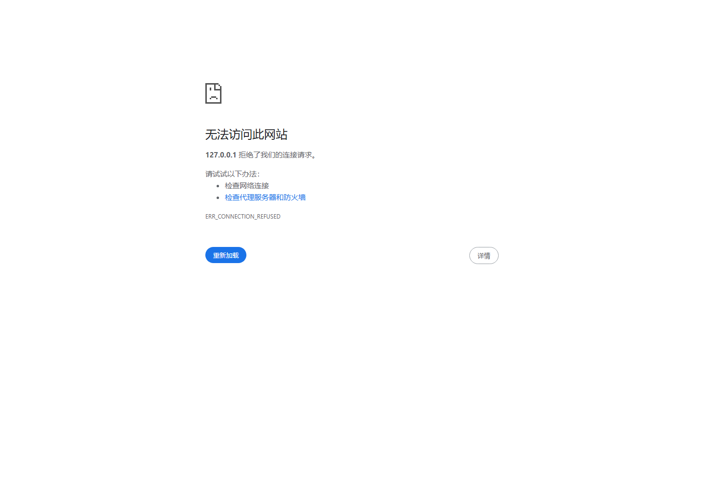

# GPT Token Look / Codex Token Lens

本地优先的 Codex Token 用量仪表盘。它读取本机 `~/.codex/sessions` 里的 JSONL 会话统计，展示 Token、模型、会话、primary/secondary 限额和 API 等价美元估算。



## 功能

- 按最近 7 天、30 天、全部记录查看用量
- 按日期范围和模型筛选会话
- 汇总 input、cached input、cache write input、output、reasoning output 和 total tokens
- 显示最新 `primary` / `secondary` 使用限额与重置时间
- 按内置或自定义价格表估算 API 等价美元成本
- 导出当前筛选结果为 CSV 或 JSON
- 自动刷新，默认每 30 秒同步一次
- 只读取本地统计字段，不读取会话正文、工具输出、`auth.json` 或 API key

## 快速开始

要求：Node.js 18+

```bash
npm install
npm start
```

打开：

```text
http://127.0.0.1:4173
```

Windows 也可以运行：

```text
start.cmd
```

Linux/macOS 也可以运行：

```bash
./start.sh
```

## 配置

| 环境变量 | 默认值 | 说明 |
| --- | --- | --- |
| `CODEX_HOME` | `~/.codex` | Codex 数据目录 |
| `TOKEN_LENS_PORT` | `4173` | 本地 HTTP 端口，设为 `0` 可随机分配 |
| `TOKEN_LENS_CACHE_DIR` | 系统临时目录 | 增量扫描缓存目录 |
| `TOKEN_LENS_PRICES_JSON` | 空 | 自定义 API 价格 JSON |
| `TOKEN_LENS_PRICING_FILE` | 空 | 自定义 API 价格 JSON 文件路径 |

PowerShell 示例：

```powershell
$env:CODEX_HOME = "$HOME\.codex"
$env:TOKEN_LENS_PORT = "4173"
npm.cmd start
```

## API

```http
GET http://127.0.0.1:4173/api/usage
```

返回字段包括：

- `sessions[]`：会话、模型、Token 和单会话美元估算
- `costSummary`：已估算会话数、未匹配价格会话数和总美元估算
- `rateLimits.primary` / `rateLimits.secondary`：最新限额窗口
- `pricing`：当前内置或自定义价格表及官方来源链接

PowerShell 调用：

```powershell
$data = Invoke-RestMethod http://127.0.0.1:4173/api/usage
$data.costSummary
$data.sessions
```

## 美元估算

价格单位为 USD / 1M tokens。默认价格表来自 OpenAI 官方 API pricing 页面：<https://platform.openai.com/pricing>

内置默认值：

| 模型 | Input | Cached input | Cache write input | Output |
| --- | ---: | ---: | ---: | ---: |
| GPT-5.6 Sol | 5.00 | 0.50 | 6.25 | 30.00 |
| GPT-5.6 Terra | 2.50 | 0.25 | 3.125 | 15.00 |
| GPT-5.6 Luna | 1.00 | 0.10 | 1.25 | 6.00 |

估算公式：

```text
billable_input = input_tokens - cached_input_tokens - cache_write_input_tokens
cost = billable_input / 1_000_000 * input_price
     + cached_input_tokens / 1_000_000 * cached_input_price
     + cache_write_input_tokens / 1_000_000 * cache_write_input_price
     + output_tokens / 1_000_000 * output_price
```

未匹配到价格的模型不会被虚构计费，会标记为 `Unpriced`。

自定义价格示例：

```powershell
$env:TOKEN_LENS_PRICES_JSON = '{"models":[{"pattern":"gpt-5.6-luna","label":"GPT-5.6 Luna","input":1,"cachedInput":0.1,"cacheWriteInput":1.25,"output":6}]}'
npm.cmd start
```

也可以放到文件里：

```json
{
  "models": [
    {
      "pattern": "gpt-5.6-luna",
      "label": "GPT-5.6 Luna",
      "input": 1,
      "cachedInput": 0.1,
      "cacheWriteInput": 1.25,
      "output": 6
    }
  ]
}
```

然后启动：

```powershell
$env:TOKEN_LENS_PRICING_FILE = "C:\path\to\pricing.json"
npm.cmd start
```

## 导出

页面里的 `Export CSV` 和 `Export JSON` 会导出当前筛选结果。导出数据包含会话标题、日期、模型、Token 明细、美元估算和是否成功匹配价格。

## 截图

仓库展示截图为 `token-lens-preview.png`。当 UI 改动后，重新启动本地服务并用浏览器或 Playwright 截图覆盖这个文件。发布前确认截图里没有私人路径、真实会话标题或敏感项目名。

## 开发与测试

```bash
npm run check
npm test
```

CI 会在 Node.js 18、20、22、24 上运行语法检查和测试。

## 隐私边界

服务只监听 `127.0.0.1`，只读取本地 Codex 会话统计字段，不上传第三方服务，不读取：

- 会话正文
- 工具输出正文
- `auth.json`
- API key
- GitHub 凭据

## License

[MIT](./LICENSE)
